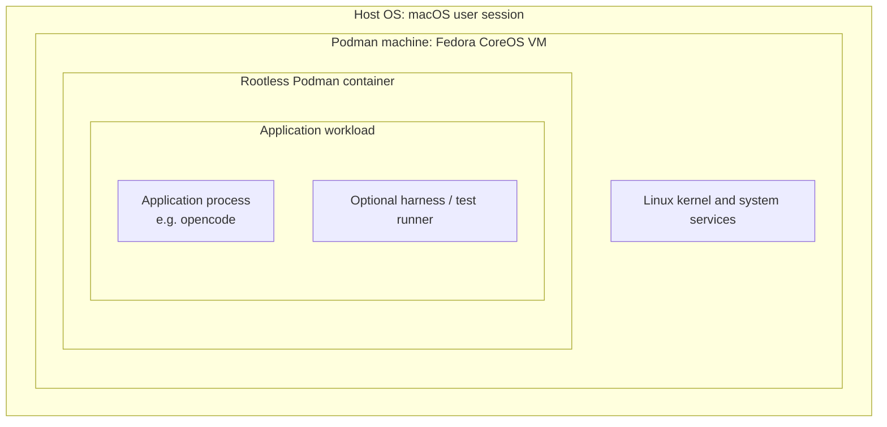

# agdev

This repo bootstraps and documents a hardened Podman machine for Apple silicon macOS development setups.

The main goal is to create a dedicated VM for agent and containerized test workloads that:

- stays rootless
- avoids Podman's broad default macOS host mounts
- can be recreated from repo-managed config and scripts
- can be verified and diagnosed with repeatable manual checks

## What It Does

The repo currently provides:

- `Brewfile` for required host tools
- `scripts/bootstrap-podman-machine` to create or start a hardened machine
- `scripts/verify-podman-machine` to check the hardening invariants
- `scripts/diagnose-podman-machine-nomount` to compare a zero-mount machine against the current control configuration
- `config/podman-machine.containers.conf` for scoped machine defaults
- `config/podman-agent-machine.playbook.yml` for optional first-boot guest provisioning

The default machine name is `dev-agents`.

## Current Security Shape

The bootstrap flow does not overwrite `~/.config/containers/containers.conf`. It creates a temporary `containers.conf` and passes it to `podman machine init` via `CONTAINERS_CONF`.

The current baseline avoids Podman's broad default shares like `/Users`, `/private`, and `/var/folders`. As implemented today, bootstrap appends one dedicated host share sourced from `.podman-machine-share` and mounts that into the guest at `/Users`.

That is narrower than the Podman default, but it is not yet a true zero-mount setup.

The intended isolation model is layered. The application runs inside a rootless container in the Podman VM, and the VM provides the Linux kernel boundary between that workload and the macOS host:



The main point of this repo is to make the container-to-host path narrower by hardening the VM configuration, especially around host mounts and exposed Podman control surfaces.

## Requirements

- macOS on Apple silicon
- Homebrew
- Podman `5.8.1` was the version validated locally in this repo

If you already have Podman installed and want to skip `brew bundle`, set `SKIP_BREW=1`.

## Quick Start

Bootstrap the default hardened machine:

```bash
./scripts/bootstrap-podman-machine
```

Bootstrap a machine with a custom name:

```bash
./scripts/bootstrap-podman-machine my-machine
```

Skip Homebrew package management:

```bash
SKIP_BREW=1 ./scripts/bootstrap-podman-machine
```

Run the verifier directly:

```bash
./scripts/verify-podman-machine dev-agents
```

## Optional Guest Provisioning

On first create, you can also apply the guest playbook:

```bash
./scripts/bootstrap-podman-machine --with-playbook
```

That path is intended for optional guest-side setup such as the dedicated `testrunner` user and socket.

`--with-playbook` only applies on first create. If the machine already exists, remove and recreate it to reprovision the guest.

## How Bootstrap Works

`scripts/bootstrap-podman-machine` does the following:

1. checks or installs Homebrew dependencies from `Brewfile`
2. renders a temporary machine config from `config/podman-machine.containers.conf`
3. appends one dedicated share from `.podman-machine-share` to `/Users`
4. creates the machine if it does not already exist
5. starts the machine
6. runs `scripts/verify-podman-machine`

`scripts/verify-podman-machine` checks:

- the machine exists and is running
- the machine is rootless
- broad host mount sources are absent
- at most one dedicated host share is configured
- `/run/podman/podman.sock` is absent in the guest
- host and guest Podman versions match

## No-Mount Diagnostics

This repo also includes a dedicated comparison workflow for investigating `volumes = []` behavior:

```bash
./scripts/diagnose-podman-machine-nomount
```

That script creates two fresh scratch machines:

- `nomount`: `volumes = []`
- `control`: one dedicated host share, matching the current bootstrap approach

It writes artifacts under:

```text
artifacts/podman-machine-diagnose/<machine-prefix>/
```

Captured artifacts include:

- generated `.ign` files
- machine inspect output
- host `vfkit` serial logs
- `gvproxy` logs when present
- macOS unified log entries for `podman`, `vfkit`, and `gvproxy`
- guest `journalctl` output when SSH becomes available

This is the right entry point if a machine fails before normal guest access is available.

## Current Findings

The current local findings are:

- Podman defaults on macOS expose broad host paths that this repo is trying to avoid.
- A fresh diagnostic run on 2026-04-11 showed that a zero-mount scratch machine can boot successfully on this host with Podman `5.8.1`.
- The zero-mount ignition still includes `immutable-root-off.service` and `immutable-root-on.service` even without any `.mount` units.
- The older `dev-agents` emergency-mode boot does not currently reproduce as a simple "zero mounts are broken" failure.

So the repo currently keeps the one-share workaround for the hardened bootstrap path, while the diagnostic workflow exists to keep investigating true zero-mount behavior.

## Manual Verification

The manual red/green checks are recorded in [TESTS.md](/Users/johan/src/agdev/TESTS.md).

The higher-level implementation notes and rationale are in [hardened-podman-machine-plan.md](/Users/johan/src/agdev/hardened-podman-machine-plan.md).
